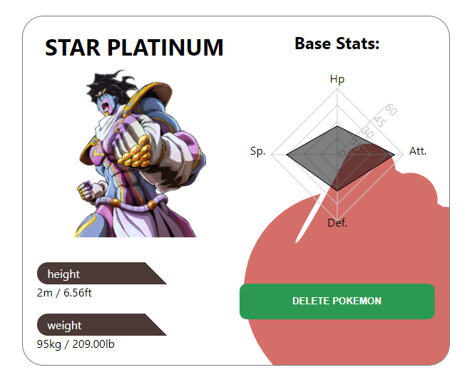

# About:
Lite Dex is a single page application made in React with Node + Express in the back-end, databes in Postgresql + Sequelize as ORM.  Some of its features are:
- Display pokemon general info (name and types) in cards.
- Menu with searchbar and options to filter by type, sort in asc or desc order given their attack or A - Z / Z - A
- Display only pokemons from the pokeapi or only those made by the user.

 

 

<ul>
  <li>
    A form to create your own pokemon.
  </li>
  <li>
    If the pokemon was made by the user, a button will be shown to delete it.
  </li>
  <li>
    A confirmation alert will be shown before deleting the pokemon.
  </li>
</ul>

 

<ul>
  <li>
    "Pokemon info" page to show more specific information (hp, base attack and defense, height and weight) displayed in a chart.
  </li>
  <li>
     If the pokemon was made by the user, a button will be shown to delete it.
  </li>
  <li>
    A confirmation alert will be shown before deleting the pokemon.
  </li>
</ul>

  
  

 

